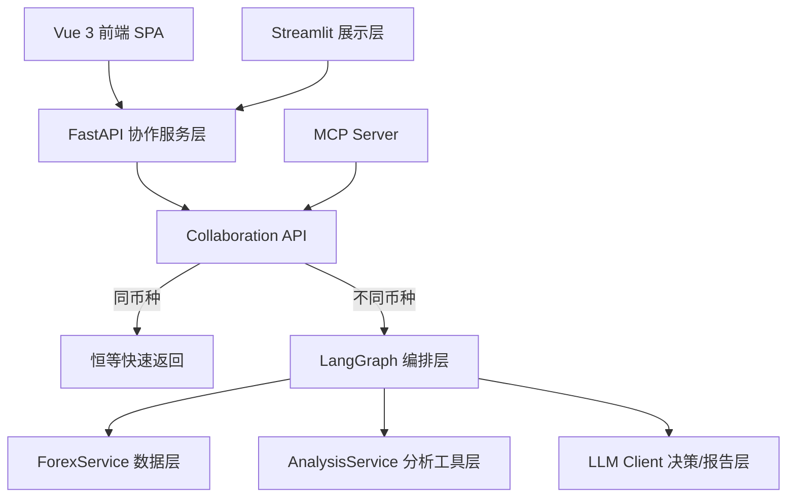
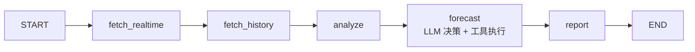
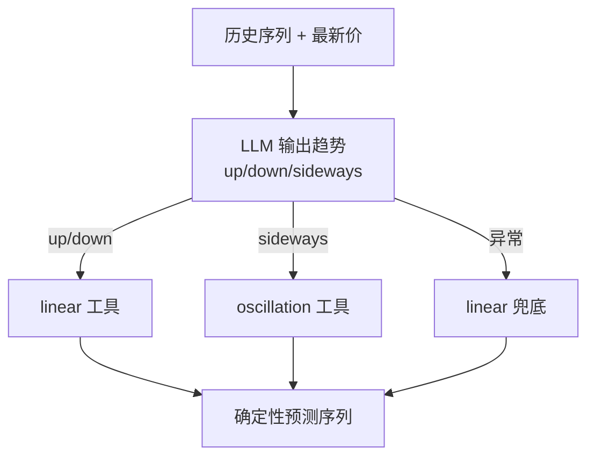
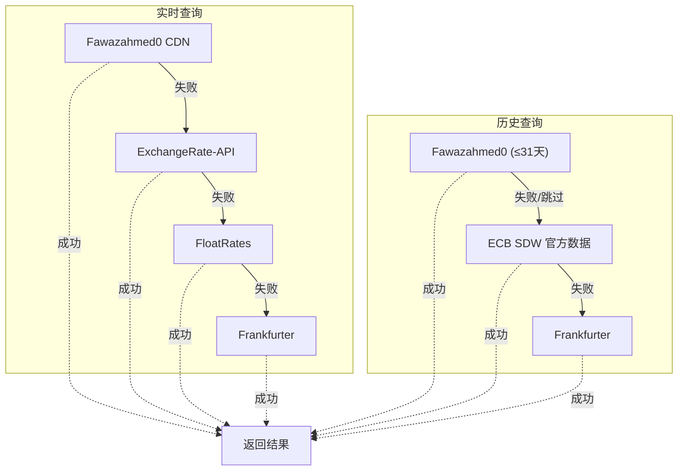
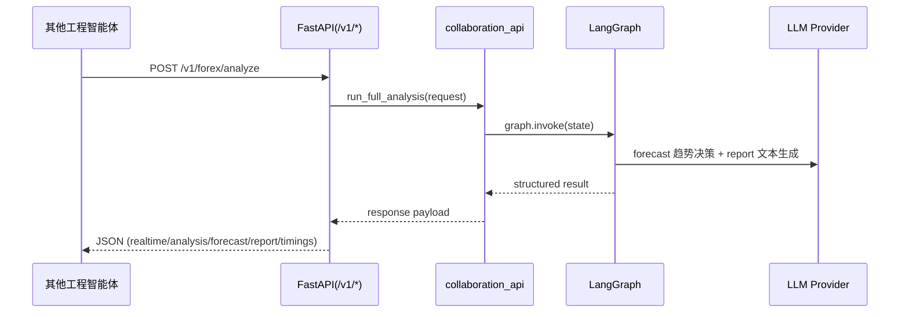
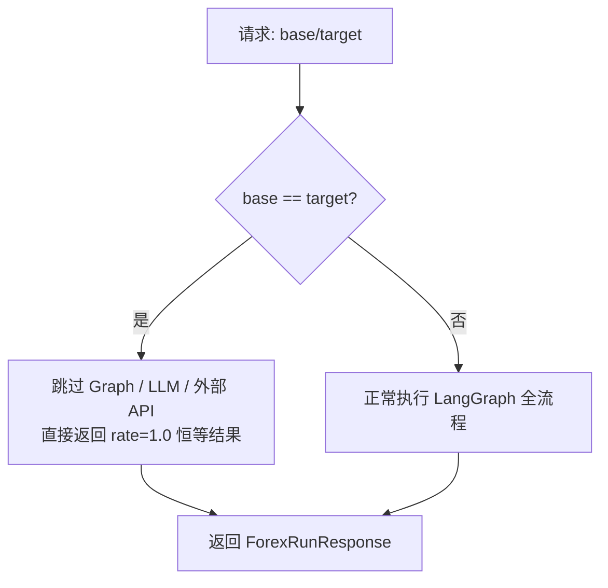
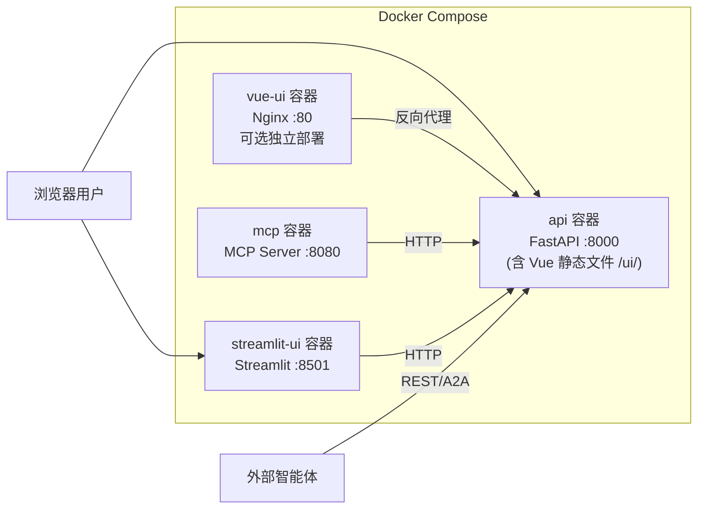
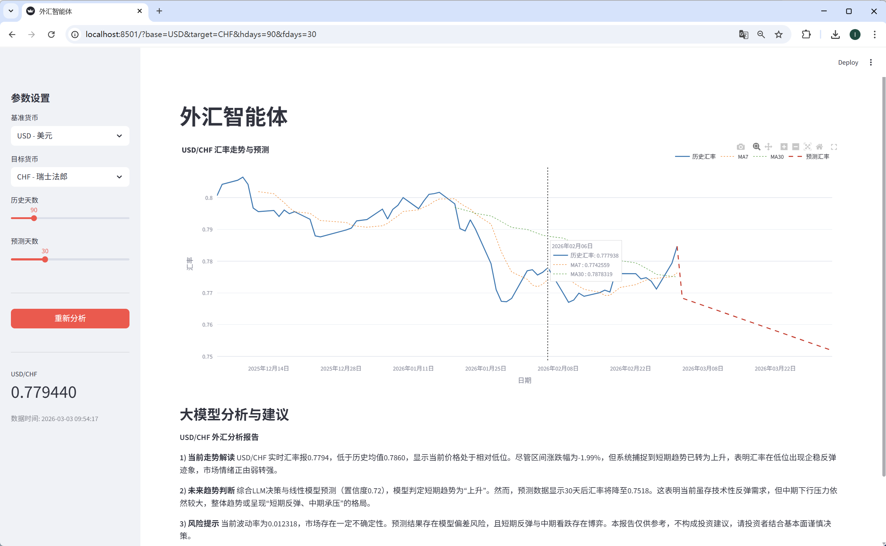

# 外汇智能体工程（LangGraph + LLM 决策 + 跨工程协作）

## 工程背景

实现如下功能的智能体：
- 汇率实时查看
- 历史数据处理分析
- 未来趋势预测
- 跨工程智能体协作（REST / MCP）
---

## 网页展示

https://github.com/user-attachments/assets/8fd8e032-2719-440f-903c-4e9888315a30

---

## 技术栈

- **语言与运行环境**：`Python 3.10+`
- **智能体编排**：`LangGraph`（状态流转与节点编排）
- **大模型接入**：`Google Gemini`、`ChatGLM / ZhipuAI`、`DeepSeek`、`vLLM 本地推理`
- **后端服务**：`FastAPI`、`Uvicorn`、`Pydantic`
- **前端展示**：`Vue 3` + `TypeScript` + `ECharts`（现代化 SPA）、`Streamlit` + `Plotly`（快速原型）
- **数据处理与预测工具**：`Pandas`、`NumPy`、`scikit-learn`
- **数据源（多源自动降级）**：`Fawazahmed0`、`ECB SDW`、`ExchangeRate-API`、`FloatRates`、`Frankfurter`
- **跨智能体协作**：`Python SDK`、`REST`、`MCP`
- **配置与环境管理**：`python-dotenv`
- **日志与可观测性**：`logging` + `RotatingFileHandler`
- **缓存与性能优化**：`functools.lru_cache`、`st.cache_data`
- **前端工具链**：`Vite`、`Element Plus`、`VueUse`、`Marked`
- **容器化部署**：`Docker`、`Docker Compose`（多阶段构建，含 Node.js 前端构建层）

---

## 1. 设计目标

- **智能体核心明确**：LangGraph 负责编排，LLM 在 `forecast` 节点做"模型选择决策"。
- **预测结果可复现**：LLM 不直接输出连续价格序列，数值预测由确定性工具执行。
- **可协作可部署**：支持同工程 SDK 调用、跨工程 HTTP 调用、MCP tool 调用。
- **可观测可回溯**：关键节点日志覆盖输入摘要、输出摘要、耗时、异常降级路径。
- **数据源高可用**：多供应商自动降级，任一源故障无感切换。
- **同币种智能处理**：base == target 时跳过全部外部调用，恒等结果瞬间返回。

---

## 2. 核心能力

- **实时汇率**：调用外部汇率数据源，提供最新汇率与日期。
- **历史分析**：输出均值、波动率、区间涨跌幅、短中期均线趋势。
- **趋势预测**：LLM 判断 `up/down/sideways`，系统路由到对应预测工具。
- **智能报告**：LLM 基于分析与预测结果生成业务可读报告。

---

## 3. 关键架构

### 3.1 系统分层图



### 3.2 LangGraph 流程图



### 3.3 预测决策路由图（重点）



### 3.4 多数据源降级架构图



### 3.5 跨工程协作时序图



### 3.6 同币种处理流程图



### 3.7 Docker 部署架构图



---

## 4. 项目结构

```text
.
├─ Dockerfile                    # 多阶段构建（api / ui / vue-ui / mcp）
├─ docker-compose.yml            # 容器编排
├─ .dockerignore
├─ streamlit_app.py              # Streamlit 展示层（HTTP 调协作服务）
├─ run_api.py                    # FastAPI 服务启动入口
├─ run_mcp.py                    # MCP 服务启动入口
├─ main.py                       # 命令行演示入口
├─ requirements.txt
├─ .env(.example)
├─ frontend/                     # Vue 3 前端（现代化 SPA）
│  ├─ src/
│  │  ├─ api.ts                  # Axios 封装，对接后端 API
│  │  ├─ types.ts                # TypeScript 类型定义
│  │  ├─ constants.ts            # 货币列表、中文名映射
│  │  ├─ composables/
│  │  │  └─ useForex.ts          # 核心状态管理（响应式 + URL 持久化）
│  │  ├─ components/
│  │  │  ├─ SidebarPanel.vue     # 侧边栏：参数设置 + 实时汇率
│  │  │  ├─ ForexChart.vue       # ECharts 图表（历史 + MA + 预测）
│  │  │  ├─ StatsRow.vue         # 统计卡片行
│  │  │  ├─ ReportPanel.vue      # 大模型分析报告（Markdown）
│  │  │  └─ TimingsBar.vue       # 节点耗时可视化
│  │  ├─ App.vue                 # 主布局
│  │  ├─ main.ts                 # 入口
│  │  └─ style.scss              # 暗色主题样式
│  ├─ vite.config.ts             # Vite 配置（代理 + chunk 分割）
│  └─ package.json
└─ src/
   ├─ config.py                  # 配置中心（模型、数据源优先级、日志、API 地址）
   ├─ state.py                   # LangGraph 状态定义
   ├─ graph.py                   # LangGraph 节点与流程
   ├─ forex_service.py           # 汇率数据获取（多源自动降级）
   ├─ analysis_service.py        # 分析 + 确定性预测工具（含 identity 模型）
   ├─ llm_client.py              # Gemini/ChatGLM/DeepSeek/vLLM 客户端封装
   ├─ collaboration_api.py       # 同工程协作 SDK（含同币种快速返回）
   ├─ api_models.py              # HTTP/A2A 协议模型
   ├─ api_server.py              # FastAPI 路由（含 Vue 静态文件托管 + CORS）
   ├─ mcp_server.py              # MCP tools 暴露
   ├─ logging_utils.py           # 统一日志初始化
   └─ model_examples.py          # 模型直连示例
```

---

## 5. 运行说明

### 5.1 本地运行

#### 安装依赖

```bash
pip install -r requirements.txt
```

#### 配置环境变量

复制 `.env.example` 为 `.env`，根据选用的大模型配置对应字段：

| LLM_PROVIDER | 必填配置 | 说明 |
|-------------|---------|------|
| `gemini` | `GEMINI_API_KEY` | Google Gemini（默认 `gemini-2.0-flash-lite`） |
| `chatglm` | `CHATGLM_API_KEY` | 智谱 ChatGLM（默认 `glm-4-flash`） |
| `deepseek` | `DEEPSEEK_API_KEY` | DeepSeek 官方 API（默认 `deepseek-chat`），兼容 OpenAI 协议 |
| `vllm` | `VLLM_BASE_URL`, `VLLM_MODEL` | 本地 vLLM 推理服务，兼容 OpenAI `/v1/chat/completions` |

**DeepSeek 配置示例：**

```env
LLM_PROVIDER=deepseek
DEEPSEEK_API_KEY=sk-xxx
DEEPSEEK_BASE_URL=https://api.deepseek.com
DEEPSEEK_MODEL=deepseek-chat
```

**vLLM 本地推理配置示例：**

```env
LLM_PROVIDER=vllm
VLLM_BASE_URL=http://localhost:8000/v1
VLLM_MODEL=Qwen/Qwen2.5-7B-Instruct
VLLM_API_KEY=EMPTY
```

> vLLM 典型启动命令：`python -m vllm.entrypoints.openai.api_server --model Qwen/Qwen2.5-7B-Instruct --port 8000 --api-key EMPTY`

#### 启动顺序

```bash
# 1) 启动协作 API（必须先启动）
python run_api.py

# 2a) Streamlit 前端（新终端）
streamlit run streamlit_app.py

# 2b) Vue 前端 - 开发模式（新终端，与 Streamlit 二选一或并行使用）
cd frontend && npm run dev
# 访问 http://localhost:5173

# 2c) Vue 前端 - 生产模式（构建后由 API 服务托管）
cd frontend && npm run build
# 访问 http://localhost:8100/ui/

# 3) 启动 MCP（可选，新终端）
python run_mcp.py
```

### 5.2 Docker 部署

#### 多阶段构建原理

Dockerfile 采用 **multi-stage build**，一个文件包含 4 个构建 target：

```text
FROM python:3.11-slim AS base        ← Python 公共层（装依赖、拷代码）
FROM node:20-slim AS vue-build       ← Vue 前端构建层（npm ci + npm run build）
        │
        ├── FROM base AS api         ← 产出镜像：forex-agent-api（含 Vue 静态文件）
        ├── FROM base AS ui          ← 产出镜像：forex-agent-ui（Streamlit）
        ├── FROM nginx:alpine AS vue-ui  ← 产出镜像：forex-agent-vue（独立 Nginx 托管）
        └── FROM base AS mcp        ← 产出镜像：forex-agent-mcp
```

构建时通过 `--target` 指定取哪个分支，**每个 target 只有一个 CMD 生效**，不会冲突。

> API 镜像已内置 Vue 前端构建产物，访问 `/ui/` 即可使用 Vue 前端，无需单独部署。

#### 镜像对照表

| 服务 | 构建 target | 镜像名 | CMD | 容器端口 | 默认宿主端口 | 环境变量覆盖 |
|------|------------|--------|-----|---------|------------|------------|
| API（含 Vue） | `api` | `forex-agent-api:latest` | `python run_api.py` | 8000 | 8000 | `API_PORT` |
| Streamlit UI | `ui` | `forex-agent-ui:latest` | `streamlit run ...` | 8501 | 8501 | `UI_PORT` |
| Vue 独立部署 | `vue-ui` | `forex-agent-vue:latest` | Nginx | 80 | 5173 | `VUE_PORT` |
| MCP | `mcp` | `forex-agent-mcp:latest` | `python run_mcp.py` | 8080 | 8080 | `MCP_PORT` |

#### 方式一：docker compose 一键部署（推荐）

```bash
# 1. 准备环境变量
cp .env.example .env
# 编辑 .env 填入你的 API Key

# 2. 构建镜像
docker compose build

# 3. 启动 API + Streamlit UI（默认）
docker compose up -d
# API:       http://localhost:8000
# Vue 前端:  http://localhost:8000/ui/  （内置于 API 镜像）
# Streamlit: http://localhost:8501

# 4. 额外启动独立 Vue 前端容器（可选）
docker compose --profile vue up -d

# 5. 启动全部服务（含 Vue + MCP）
docker compose --profile full up -d
```

compose 内部已通过 `build.target` 指定各服务对应的构建分支，`image` 字段指定产出镜像名。
`streamlit-ui` 服务配置了 `depends_on: api (condition: service_healthy)`，会等 API 健康检查通过后才拉起。

#### 方式二：手动 docker build（脱离 compose）

```bash
# 按 target 逐个构建
docker build --target api    -t forex-agent-api .
docker build --target ui     -t forex-agent-ui  .
docker build --target vue-ui -t forex-agent-vue .
docker build --target mcp    -t forex-agent-mcp .

# 启动 API（Vue 前端已内置，访问 /ui/）
docker run -d --name forex-api --env-file .env -p 8000:8000 -v ./logs:/app/logs forex-agent-api

# 启动 Streamlit UI（需要指向 API 地址）
docker run -d --name forex-ui --env-file .env \
  -e COLLAB_API_BASE_URL=http://host.docker.internal:8000 \
  -p 8501:8501 forex-agent-ui

# 启动独立 Vue 前端（可选，Nginx 托管）
docker run -d --name forex-vue -p 5173:80 forex-agent-vue

# 启动 MCP（可选）
docker run -d --name forex-mcp --env-file .env \
  -e COLLAB_API_BASE_URL=http://host.docker.internal:8000 \
  -p 8080:8080 forex-agent-mcp
```

> 注：`host.docker.internal` 是 Docker Desktop 提供的宿主机地址（Linux 生产环境替换为实际 IP 或使用 Docker 网络）。

#### 常用运维命令

```bash
# 查看服务状态
docker compose ps

# 查看实时日志
docker compose logs -f
docker compose logs -f api     # 仅看 API 日志

# 仅重建并重启某个服务
docker compose build api
docker compose up -d api

# 停止并清理
docker compose down

# 清理构建缓存
docker builder prune
```

---

## 6. 多数据源架构

| 数据源 | 实时查询 | 历史查询 | 特点 |
|--------|---------|---------|------|
| **Fawazahmed0** | 首选 | 首选（≤31天） | CDN 加速，免费无 Key |
| **ECB SDW** | — | 第二选 | 欧洲央行官方 API，批量区间查询，极其稳定 |
| **ExchangeRate-API** | 第二选 | — | 公开免 Key 端点 |
| **FloatRates** | 第三选 | — | 公开免 Key 端点 |
| **Frankfurter** | 兜底 | 兜底 | ECB 数据转发，偶尔不稳定 |

优先级可通过环境变量配置：
```env
FOREX_PROVIDER_PRIORITY=fawazahmed,exchangerate_api,floatrates,frankfurter
FOREX_HISTORY_PROVIDER_PRIORITY=fawazahmed,ecb,frankfurter
```

---

## 7. 协作接口

### 7.1 同工程 SDK 接口

文件：`src/collaboration_api.py`

- `get_realtime_quote(...)`
- `run_full_analysis(request)`
- `build_customer_agent_context(request)`

### 7.2 REST 接口（跨工程推荐）

- `GET /health`
- `POST /v1/forex/realtime`
- `POST /v1/forex/analyze`
- `POST /v1/a2a/message`（A2A-style 通用入口）

示例：

```bash
curl -X POST "http://localhost:8000/v1/forex/analyze" \
  -H "Content-Type: application/json" \
  -d '{
    "base_currency": "USD",
    "target_currency": "CNY",
    "history_days": 90,
    "forecast_days": 30,
    "caller_agent": "customer_service_agent",
    "caller_task_id": "ticket-1024"
  }'
```

### 7.3 MCP Tools 接口

`run_mcp.py` 启动后暴露工具：
- `get_realtime_quote`
- `run_full_analysis`
- `build_customer_context`

---

## 8. 日志与可观测性

日志文件：`logs/forex_agent.log`

关键日志事件：
- `node_start` / `node_end`：节点输入输出摘要与耗时
- `forecast_tool_selected`：LLM 选择的预测工具
- `forecast_llm_decision_failed`：决策异常与回退
- `llm_request` / `llm_response` / `llm_empty_response`
- `forex_realtime_success` / `forex_realtime_failed`：数据源命中与降级
- `forex_history_success` / `forex_history_failed` / `forex_history_skip`：历史源降级链
- `collab_call` / `collab_return`：跨智能体协作调用链

---

## 9. 已实现的工程约束

- **确定性优先**：预测值由确定性工具产生，降低 LLM 随机性。
- **容错降级**：LLM 决策失败时自动回退 `linear`；数据源失败时自动切换备用源。
- **边界处理**：同币种请求跳过全部外部调用，恒等结果瞬间返回。
- **展示层解耦**：Streamlit / Vue 前端仅做 UI，不直接调用 graph。
- **双前端方案**：Vue 3 现代化 SPA（暗色科技风）+ Streamlit 快速原型，按需选用。
- **跨工程友好**：REST + A2A-style + MCP 三种协作形态。
- **容器化就绪**：Dockerfile 多阶段构建（含 Node.js 前端构建层）+ Compose 一键部署。

---

## 10. 说明与边界

- 本项目用于工程展示和技术交流，不构成投资建议。
- 汇率实时性取决于上游数据源更新频率。
- LLM 供应商响应质量受模型版本与网络状态影响。

---

## 11. 界面展示



---

## FAQ. 快速问答（高频）

- **Q: 智能体体现在哪？**
  A: LangGraph 节点编排 + LLM 决策路由（forecast）+ 工具调用执行。

- **Q: 为什么不是 LLM 直接给价格序列？**
  A: 为了结果可复现与可控，LLM 做策略决策，数值由确定性模型输出。

- **Q: 如何与别的智能体协作？**
  A: 同工程可用 SDK，跨工程可用 FastAPI 或 MCP tools。

- **Q: 如何排查性能瓶颈？**
  A: 看 `node_timings` 和日志中的 `node_end elapsed` 字段。

- **Q: 某个数据源挂了怎么办？**
  A: 无需干预，系统自动降级到下一个可用数据源，日志中会记录 `forex_*_failed` 和最终命中的 provider。

- **Q: 如何自定义数据源优先级？**
  A: 修改 `.env` 中的 `FOREX_PROVIDER_PRIORITY` 和 `FOREX_HISTORY_PROVIDER_PRIORITY`。

- **Q: Docker 部署后如何查看日志？**
  A: `docker compose logs -f api` 查看 API 日志，或查看挂载的 `./logs/forex_agent.log`。

- **Q: 选择了相同的基准货币和目标货币会怎样？**
  A: 系统检测到同币种后跳过 Graph / LLM / 外部 API，直接返回 rate=1.0 的恒等结果，瞬间响应。

- **Q: Vue 前端和 Streamlit 前端有什么区别？**
  A: Vue 3 前端是现代化 SPA，暗色科技风 UI，ECharts 交互图表，适合正式演示；Streamlit 是快速原型，开发迭代快。两者共用同一套后端 API。

- **Q: Vue 前端如何访问？**
  A: 开发模式 `cd frontend && npm run dev` 访问 `http://localhost:5173`；生产模式 `npm run build` 后访问 `http://localhost:8100/ui/`（由 FastAPI 托管静态文件）。

