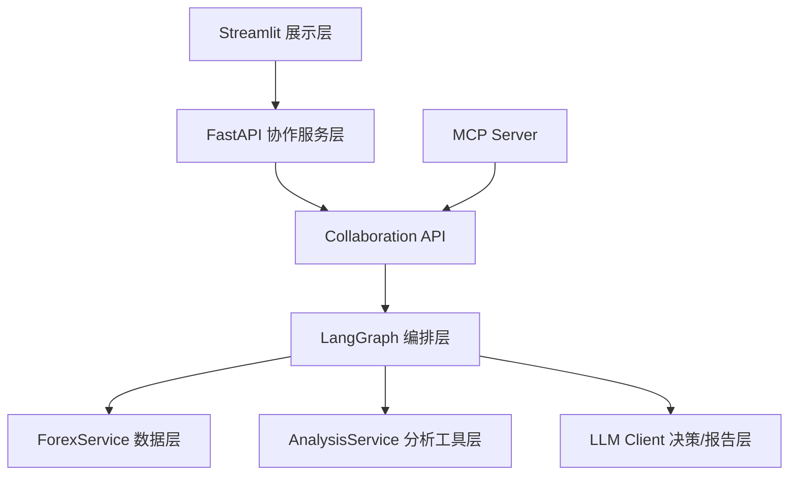
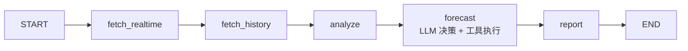
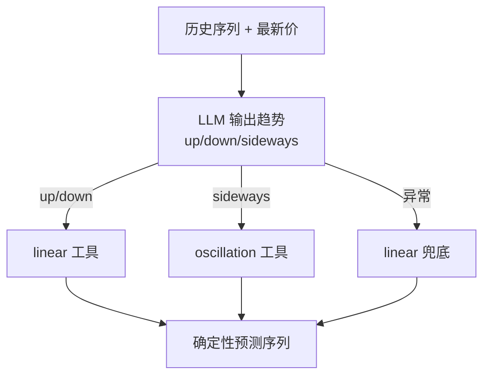
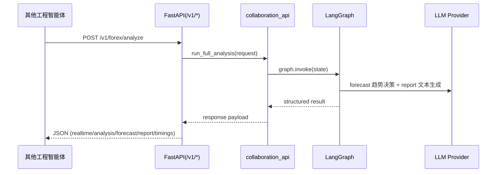

# 外汇智能体工程（LangGraph + LLM 决策 + 跨工程协作）

## 工程背景
实现如下功能的智能体：
- 汇率实时查看
- 历史数据处理分析
- 未来趋势预测
- 跨工程智能体协作（REST / MCP）

---
## 技术栈
- **语言与运行环境**：`Python 3.10+`
- **智能体编排**：`LangGraph`（状态流转与节点编排）
- **大模型接入**： `Google Gemini`、`ChatGLM` / `ZhipuAI`
- **后端服务**：`FastAPI`、`Uvicorn`、`Pydantic`
- **前端展示**：`Streamlit`、`Plotly`
- **数据处理与预测工具**：`Pandas`、`NumPy`、`scikit-learn`
- **数据源与网络请求**：`Frankfurter API`、`Requests`
- **跨智能体协作**：`Python SDK`，`REST`，`MCP`
- **配置与环境管理**：`python-dotenv`
- **日志与可观测性**：`logging` + `RotatingFileHandler`
- **缓存与性能优化**：`functools.lru_cache`、`st.cache_data`

-----


## 1. 设计目标

- **智能体核心明确**：LangGraph 负责编排，LLM 在 `forecast` 节点做“模型选择决策”。
- **预测结果可复现**：LLM 不直接输出连续价格序列，数值预测由确定性工具执行。
- **可协作可部署**：支持同工程 SDK 调用、跨工程 HTTP 调用、MCP tool 调用。
- **可观测可回溯**：关键节点日志覆盖输入摘要、输出摘要、耗时、异常降级路径。

---

## 2. 核心能力

- **实时汇率**：调用外部汇率数据源，提供最新汇率与日期。
- **历史分析**：输出均值、波动率、区间涨跌幅、短中期均线趋势。
- **趋势预测**：LLM 判断 `up/down/sideways`，系统路由到对应预测工具。
- **智能报告**：LLM 基于分析与预测结果生成业务可读报告。

---

## 3. 关键架构

### 3.1 系统分层图



### 3.2 LangGraph 流程图



### 3.3 预测决策路由图（重点）



### 3.4 跨工程协作时序图



---

## 4. 项目结构

```text
.
├─ streamlit_app.py              # 展示层（仅通过 HTTP 调协作服务）
├─ run_api.py                    # FastAPI 服务启动入口
├─ run_mcp.py                    # MCP 服务启动入口
├─ main.py                       # 命令行演示入口
├─ requirements.txt
├─ .env(.example)
└─ src/
   ├─ config.py                  # 配置中心（模型、刷新、日志、API 地址）
   ├─ state.py                   # LangGraph 状态定义
   ├─ graph.py                   # LangGraph 节点与流程
   ├─ forex_service.py           # 汇率数据获取
   ├─ analysis_service.py        # 分析 + 确定性预测工具
   ├─ llm_client.py              # Gemini/ChatGLM 客户端封装
   ├─ collaboration_api.py       # 同工程协作 SDK
   ├─ api_models.py              # HTTP/A2A 协议模型
   ├─ api_server.py              # FastAPI 路由
   ├─ mcp_server.py              # MCP tools 暴露
   ├─ logging_utils.py           # 统一日志初始化
   └─ model_examples.py          # 模型直连示例
```

---

## 5. 运行说明

### 5.1 安装依赖

```bash
pip install -r requirements.txt
```

### 5.2 配置环境变量

至少配置以下字段（`.env`）：
- `LLM_PROVIDER=gemini` 或 `chatglm`
- `GEMINI_API_KEY` / `CHATGLM_API_KEY`
- `COLLAB_API_BASE_URL`（默认 `http://127.0.0.1:8000`）

### 5.3 启动顺序

1) 启动协作 API：

```bash
python run_api.py
```

2) 启动前端：

```bash
streamlit run streamlit_app.py
```

3) 启动 MCP（可选）：

```bash
python run_mcp.py
```

---

## 6. 协作接口

### 6.1 同工程 SDK 接口

文件：`src/collaboration_api.py`

- `get_realtime_quote(...)`
- `run_full_analysis(request)`
- `build_customer_agent_context(request)`

### 6.2 REST 接口（跨工程推荐）

- `GET /health`
- `POST /v1/forex/realtime`
- `POST /v1/forex/analyze`
- `POST /v1/a2a/message`（A2A-style 通用入口）

示例：

```bash
curl -X POST "http://localhost:8000/v1/forex/analyze" \
  -H "Content-Type: application/json" \
  -d '{
    "base_currency": "USD",
    "target_currency": "CNY",
    "history_days": 90,
    "forecast_days": 30,
    "caller_agent": "customer_service_agent",
    "caller_task_id": "ticket-1024"
  }'
```

### 6.3 MCP Tools 接口

`run_mcp.py` 启动后暴露工具：
- `get_realtime_quote`
- `run_full_analysis`
- `build_customer_context`

---

## 7. 日志与可观测性

日志文件：`logs/forex_agent.log`

关键日志事件：
- `node_start` / `node_end`：节点输入输出摘要与耗时
- `forecast_tool_selected`：LLM 选择的预测工具
- `forecast_llm_decision_failed`：决策异常与回退
- `llm_request` / `llm_response` / `llm_empty_response`
- `collab_call` / `collab_return`：跨智能体协作调用链

---

## 8. 已实现的工程约束

- **确定性优先**：预测值由确定性工具产生，降低 LLM 随机性。
- **容错降级**：LLM 决策失败时自动回退 `linear`。
- **展示层解耦**：Streamlit 仅做 UI，不直接调用 graph。
- **跨工程友好**：REST + A2A-style + MCP 三种协作形态。

---

## 9. 说明与边界

- 本项目用于工程展示和技术交流，不构成投资建议。
- 汇率实时性取决于上游数据源更新频率。
- LLM 供应商响应质量受模型版本与网络状态影响。

---

## 10. 界面展示


## FAQ. 快速问答（高频）

- **Q: 智能体体现在哪？**  
  A: LangGraph 节点编排 + LLM 决策路由（forecast）+ 工具调用执行。

- **Q: 为什么不是 LLM 直接给价格序列？**  
  A: 为了结果可复现与可控，LLM 做策略决策，数值由确定性模型输出。

- **Q: 如何与别的智能体协作？**  
  A: 同工程可用 SDK，跨工程可用 FastAPI 或 MCP tools。

- **Q: 如何排查性能瓶颈？**  
  A: 看 `node_timings` 和日志中的 `node_end elapsed` 字段。
